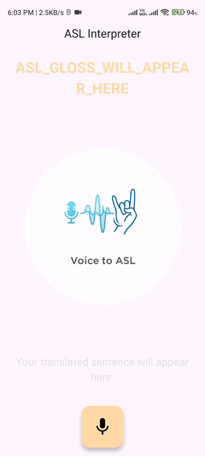
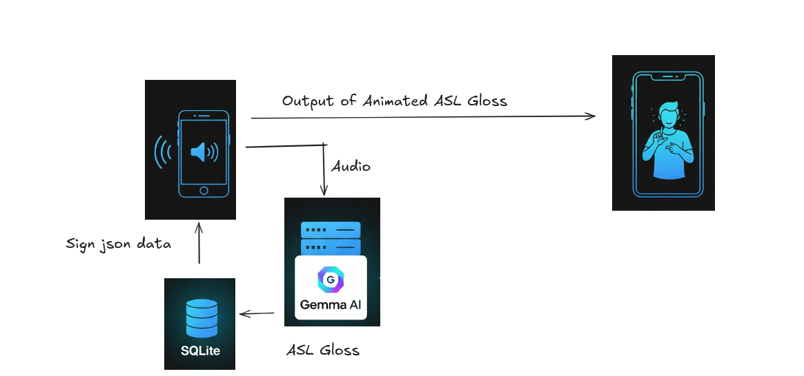

# Gemma-Sign-AI

[](https://opensource.org/licenses/MIT)
[](https://flutter.dev)

A real-time, on-device Speech-to-ASL interpreter that visualizes American Sign Language gestures using a custom animation engine, powered by Google's Gemma.

---

## 🎥 Live Demo


*Real-time interpretation of spoken language into an animated ASL stick avatar.*

---

## 🌟 Project Description

**Gemma-Sign-AI** is a Flutter-based mobile application designed to serve as a real-time interpreter, converting spoken language into animated American Sign Language (ASL). 




This project is built with a focus on creating a practical, high-performance, and socially beneficial application of local, on-device AI.

---

## ✨ Core Features

*   **🎙️ Real-Time Voice Activity Detection (VAD):** Intelligently captures complete sentences by detecting the natural pauses at the end of an utterance, creating a seamless user experience.
*   **🧠 On-Device AI with Gemma:** Utilizes a local Gemma model via a Python/Flask server for fast and private speech-to-text and translation into ASL gloss.
*   **🗃️ Comprehensive & Compressed Local Database:** Ships with a pre-seeded SQLite database containing animation data for **alphabets, numbers (0-30), and 2000+ words**. All landmark data is compressed with Gzip, significantly reducing storage requirements.


---

## 🛠️ Technology Stack

| Component         | Technology                                                                                                                                                            | Purpose                                       |
| ----------------- | --------------------------------------------------------------------------------------------------------------------------------------------------------------------- | --------------------------------------------- |
| **Mobile App**    | [](https://flutter.dev) [Dart](https://dart.dev)                 | Cross-platform application framework          |
| **AI Model**      | [](https://ai.google.dev/gemma)                      | Speech-to-Text & ASL Gloss Translation        |
| **Backend**       | [](https://www.python.org) / [Flask](https://flask.palletsprojects.com/) | Local server to host the Gemma model endpoint |
| **Voice Capture** | [`vad` Flutter Package](https://pub.dev/packages/vad)                                                                                                                 | Voice Activity Detection                      |
| **Database**      | [](https://www.sqlite.org/index.html)                              | On-device storage for all sign data           |
| **Compression**   | [`Gzip`](https://en.wikipedia.org/wiki/Gzip)                                                                                                                          | Reducing database size                        |
| **Animation**     | [`CustomPainter` API](https://api.flutter.dev/flutter/rendering/CustomPainter-class.html)                                                                             | High-performance, frame-by-frame rendering    |

---

## 🏗️ Architecture & Data Flow

**User Speaks** ➡️ **1. VAD Captures Audio** ➡️ **2. WAV Encoding** ➡️ **3. HTTP Request to Local Server** ➡️ **4. Gemma Processes Audio** ➡️ **5. JSON Response (Sentence + Gloss)** ➡️ **6. App Adds Job to Queue** ➡️ **7. Animation Worker Fetches from DB** ➡️ **8. `SignerPainter` Renders Animation**

---

## 🚀 Getting Started

This project requires a one-time manual setup for the sign language animation data due to its large size (~600 MB). Please follow these steps carefully.

### Step 1: Clone the Repository

```sh
git clone https://github.com/tinisoft/Gemma-Sign-AI.git
cd Gemma-Sign-AI
```

### Step 2: Asset Setup (Important!)

The animation data is not included in the repository and must be downloaded separately.

1.  **Download the Assets:**
    *   Download the `signs.zip` file from the following link:
    *   **[➡️ Click here to download the 600 MB assets from Google Drive](https://drive.google.com/file/d/1VzrE4VAOmHLH9HEDenbFaAwMHjNicBmh/view?usp=sharing)**

2.  **Place the Assets:**
    *   Unzip the downloaded file.
    *   You should now have a folder named `signs`.
    *   Place this entire `signs` folder inside the `assets` directory of the project.
    *   Your final folder structure should look like this:
    ```
    Gemma-Sign-AI/
    ├── assets/
    │   ├── signs/       <-- The folder you just moved
    │   │   ├── alphabets/
    │   │   ├── numbers/
    │   │   └── words/
    │   └── ... (other assets)
    ├── lib/
    └── pubspec.yaml
    ```

3.  **Enable Assets in `pubspec.yaml`:**
    *   Open the `pubspec.yaml` file.
    *   Find the `assets:` section and uncomment the lines for the `signs` subdirectories.

    **Before:**
    ```yaml
    assets:
      - .env
      - assets/images/dummy_image.png
      # - assets/signs/alphabets/hand/
      # - assets/signs/alphabets/pose/
      # - assets/signs/numbers/hand/
      # - assets/signs/numbers/pose/
      # - assets/signs/words/hand/
      # - assets/signs/words/pose/
    ```

    **After:**
    ```yaml
    assets:
      - .env
      - assets/images/dummy_image.png
      - assets/signs/alphabets/hand/
      - assets/signs/alphabets/pose/
      - assets/signs/numbers/hand/
      - assets/signs/numbers/pose/
      - assets/signs/words/hand/
      - assets/signs/words/pose/
    ```
    *   After saving the file, run `flutter pub get` in your terminal.
    
    
4.  **Configure the API Endpoint:**
 The application loads the AI server URL from an environment file to keep it separate from the source code.
    *   Create a .env file in the root directory of the project.
    *   Open the new .env file and set the BASE_URL variable to point to your local Gemma server.
        *   `BASE_URL="http://mlserver1:5000"`

### Step 3: Database Seeding (First-Time Run)

The app needs to load all the JSON animation data into a local SQLite database. This is an intensive, one-time process.

1.  **⚙️ Enable Seeding in Code:**
    *   Open the file `lib/main.dart`.
    *   Find the `main` function and **uncomment** the `await databaseSeeding();` line.

    **Before:**
    ```dart
    // await databaseSeeding();
    runApp(HomeView());
    ```

    **After:**
    ```dart
    await databaseSeeding();
    runApp(HomeView());
    ```

2.  **🚀 Run the Seeding Process:**
    *   Install dependencies if you haven't already: `flutter pub get`
    *   Run the application: `flutter run`
    *   **Watch the debug console.** You will see progress messages as the app seeds the alphabets, numbers, and words. This will take a few minutes to complete. Please wait until you see the final "seeding complete" message.
    *   Once seeding is complete, Press the mic to listen.

I can help with that. Here's a rewritten version of your text.

***

## How We Prepared and Fine-Tuned the Model

We took a two-pronged approach to preparing our datasets before fine-tuning the model. First, we focused on American Sign Language (ASL), and then on Automatic Speech Recognition (ASR).

### 1. Preparing the Sign Language Dataset 🤟

We utilized the **MediaPipe** framework to extract hand poses and finger movements from the WLASL (World Level American Sign Language) dataset.  The extracted data was then organized into a structured JSON format. We sourced this dataset from Kaggle:
`https://www.kaggle.com/datasets/risangbaskoro/wlasl-processed`

***

### 2. Preparing the ASR Dataset with ASL Gloss 🗣️

To create a transcription dataset, we used the LibriSpeech ASR dataset. We added **few-shot examples** and specific rules to a prompt to generate ASL Gloss equivalents for the audio. This process synthesized the necessary data for our model.

The code for this process can be found here: `scripts/synth_asl_gloss_asr_dataset.py`

***

### 3. Fine-Tuning the Model 💻

After preparing both the sign language and ASR datasets, we fine-tuned our model. We used the **Unsloth** library to perform this fine-tuning on the datasets we created.

The fine-tuning script is located at: `scripts/gemma-3n-4b-audio-finetuning.py`

### 4. To run API server
Use the following script to run the Gemma3 model,
`scripts/`


## 🗺️ Future Roadmap

This project has a strong foundation, but the vision for it is much larger. The following roadmap outlines key areas for future development, focusing on technological enhancement and expanding the application's capabilities.

### Core Technology & Integration

*   [ ] **Transition to Native On-Device Inference:** The app currently uses a local Python/Flask server to host the Gemma model. This is a temporary architecture chosen because direct Gemma support in the MediaPipe GenAI Task library for Flutter is still under active development (as evidenced by ongoing work like commit [`d148cf9`](https://github.com/google-ai-edge/mediapipe/commit/d148cf9bcc1feeb8494be7a73e1d7539f0b729a0)). A primary goal is to migrate to a fully native, on-device solution once the necessary APIs are released. This will eliminate the need for a separate server, vastly simplify user setup, and create a truly self-contained, offline-first application.
*   [ ] **Model Optimization:** Continuously fine-tune and explore quantized versions of the local Gemma model to achieve lower latency and improved translation accuracy on a wider range of mobile devices.

### Feature Enhancements

*   [ ] **Incorporate Facial Expressions & Body Language:** ASL is more than just hands. The data pipeline will be extended to include facial landmarks (eyebrows, mouth, gaze) to animate more expressive and grammatically accurate signs.
*   [ ] **Enhance Learning with Playback Controls:** Introduce controls to allow users to pause, loop, and adjust the playback speed of animations. This transforms the tool from a real-time interpreter into a valuable learning aid.
*   [ ] **Expand the Lexicon:** Continuously expand the local database with thousands of additional words and common phrases to increase the interpreter's practical vocabulary.

### Future Vision & New Capabilities

*   [ ] **Implement Two-Way Communication: Sign-to-Speech:** The ultimate vision for this project is to become a complete two-way communication tool. The next major phase will involve using the device's camera to recognize and interpret sign language gestures in real-time, converting them back into spoken audio and text.
*   [ ] **Migrate to a Dedicated Animation Runtime (Rive):** To further enhance performance and visual fidelity, investigate migrating the `CustomPainter` engine to a stateful animation runtime like [Rive](https://rive.app/). This would allow for even smoother animations and more complex character interactions.

---
